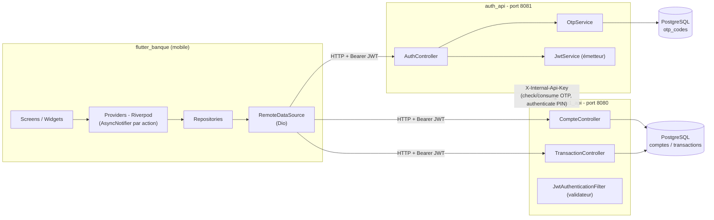
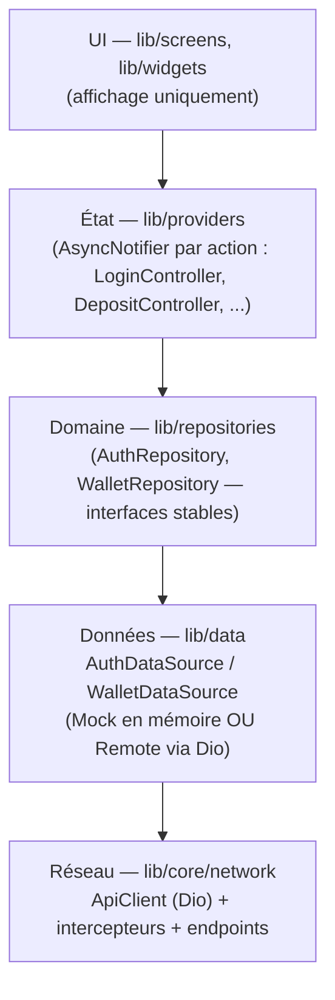
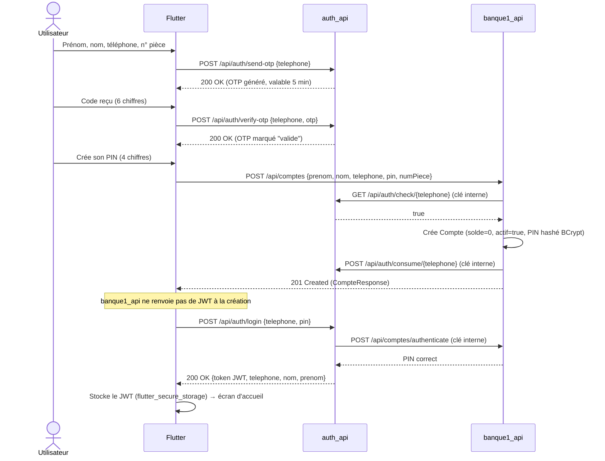
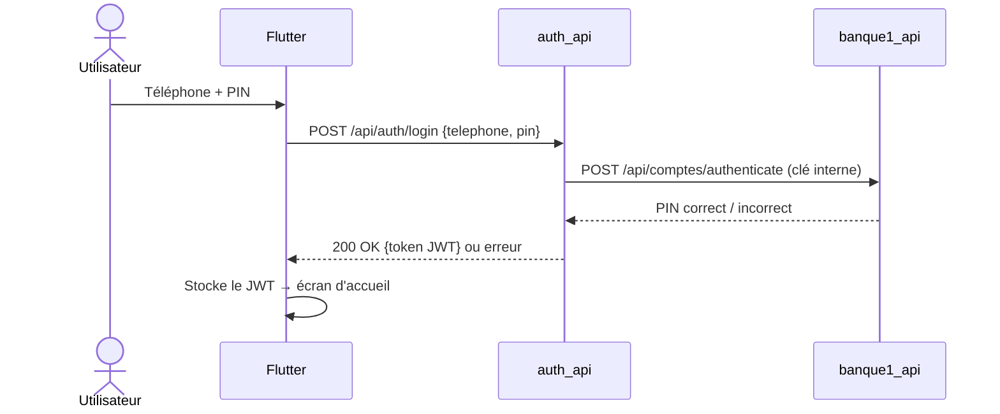
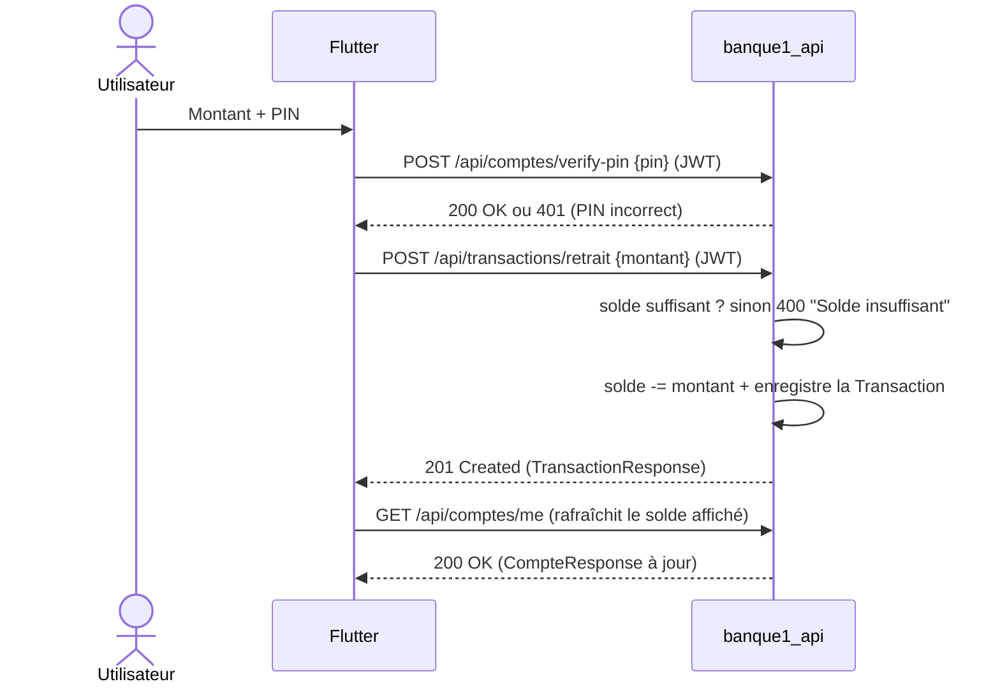

# Banque — Application mobile Flutter


Application bancaire mobile développée en **Flutter**, consommant deux microservices **Spring Boot** :

| Service | Rôle | Port |
|---|---|---|
| [`auth_api`](../auth_api) | Authentification : envoi/vérification d'OTP, connexion, émission des JWT | `8081` |
| [`banque1_api`](../banque1_api) | Cœur bancaire : comptes, dépôts, retraits, paiements, historique | `8080` |

Ce document explique **comment les trois briques fonctionnent ensemble** : la création de compte, l'OTP, la connexion, les transactions, et la manière dont le frontend Flutter consomme les deux API.

> Une documentation technique plus détaillée (diagrammes de séquence complets, architecture Clean en profondeur) existe déjà dans [`docs/`](docs/) et reste la référence à jour pour le code Flutter. Ce README en est la synthèse, complétée par le fonctionnement des deux backends.

## Sommaire

- [Vue d'ensemble](#vue-densemble)
- [Backend `auth_api` — Authentification & OTP](#backend-auth_api--authentification--otp)
- [Backend `banque1_api` — Comptes & transactions](#backend-banque1_api--comptes--transactions)
- [Communication entre les deux backends](#communication-entre-les-deux-backends)
- [Frontend Flutter](#frontend-flutter)
- [Comment le frontend consomme les deux API](#comment-le-frontend-consomme-les-deux-api)
- [Flux détaillés](#flux-détaillés)
- [Démarrage rapide](#démarrage-rapide)
- [Limites connues (contexte académique)](#limites-connues-contexte-académique)

## Vue d'ensemble



Points clés de l'architecture :

- **`auth_api` émet les JWT, `banque1_api` les valide** — les deux services partagent le même secret (`jwt.secret`) en configuration ; il n'y a pas d'appel réseau de validation à chaque requête, juste une vérification de signature HMAC locale.
- Les deux backends communiquent entre eux en **serveur à serveur**, via une **clé interne partagée** (`X-Internal-Api-Key`), jamais via le JWT de l'utilisateur.
- **La création de compte vit dans `banque1_api`**, pas dans `auth_api` : `auth_api` ne fait que gérer l'OTP et la connexion.
- Le frontend Flutter est construit en **Clean Architecture** (UI → Providers → Repositories → DataSources) avec une bascule **Mock ↔ Remote** ne nécessitant qu'un seul changement de configuration.

## Backend `auth_api` — Authentification & OTP

**Stack** : Spring Boot 3.5, Java 21, Spring Security (stateless), Spring Cloud OpenFeign (appels vers `banque1_api`), JJWT 0.11.5, PostgreSQL, Swagger/OpenAPI.

`auth_api` ne possède qu'une seule entité, `OtpCode` (table `otp_codes`) : `telephone`, `code` (6 chiffres), `valide`, `utilise`, `createdAt`, `expiresAt`. Le compte utilisateur (`Compte`) n'existe pas ici — il est géré par `banque1_api` et référencé côté `auth_api` uniquement via un DTO Feign.

### Endpoints

| Méthode | Endpoint | Auth | Corps | Rôle |
|---|---|---|---|---|
| POST | `/api/auth/send-otp` | Public | `{ telephone }` | Génère et envoie un OTP |
| POST | `/api/auth/verify-otp` | Public | `{ telephone, otp }` | Vérifie le code saisi |
| POST | `/api/auth/login` | Public | `{ telephone, pin }` | Authentifie et renvoie un JWT |
| GET | `/api/auth/validate-token` | Bearer JWT | — | Vérifie la validité d'un token |
| GET | `/api/auth/check/{telephone}` | Clé interne | — | Utilisé par `banque1_api` : un OTP valide et non consommé existe-t-il ? |
| POST | `/api/auth/consume/{telephone}` | Clé interne | — | Utilisé par `banque1_api` : marque l'OTP comme consommé |

### Le flux OTP en détail

1. **Génération** (`OtpService.generateCode`) : `SecureRandom.nextInt(900000) + 100000` → un code numérique à **6 chiffres**.
2. **Stockage** : en base PostgreSQL (table `otp_codes`), pas de cache/Redis. Tout OTP précédent non validé/non utilisé pour le même numéro est supprimé avant d'en créer un nouveau.
3. **Durée de validité** : **5 minutes** (`OTP_EXPIRY_MINUTES = 5`).
4. **Envoi** : ⚠️ **aucune intégration SMS ou email n'est branchée** (pas de dépendance mail/Twilio) — le code est simplement écrit dans les logs du serveur (`log.info`). C'est un raccourci assumé de projet académique ; en production, cette étape appellerait un vrai fournisseur SMS/email.
5. **Vérification** (`/verify-otp`) : recherche le dernier OTP `telephone + code` avec `valide=false, utilise=false` ; rejette si introuvable ou expiré ; sinon passe `valide=true`.
6. **Consommation** : lors de la création du compte, `banque1_api` appelle `GET /check/{telephone}` (doit renvoyer `true`), crée le compte, puis appelle `POST /consume/{telephone}` pour empêcher toute réutilisation du même OTP.

### Le flux de connexion (login) en détail

`AuthHelper.handleLogin()` :

1. Normalise le numéro de téléphone.
2. Appelle **`banque1_api`** via Feign (`POST /api/comptes/authenticate`, protégé par la clé interne) qui vérifie `telephone + pin` contre le hash BCrypt stocké.
3. Si le compte est inactif (`actif=false`), la connexion est refusée.
4. Si le PIN est correct, `JwtService.generateToken(telephone)` émet un JWT :
   - **Algorithme** : HS256, clé = `jwt.secret` (identique entre `auth_api` et `banque1_api`)
   - **Claims** : `sub = telephone`, `iat`, `exp`
   - **Durée de vie** : 24 h (`jwt.expiration = 86400000` ms)
5. Aucun refresh token n'existe : une fois expiré, l'utilisateur doit se reconnecter (`/validate-token` permet au client de vérifier la validité en amont).

## Backend `banque1_api` — Comptes & transactions

**Stack** : Spring Boot 4.0, Java 21, Spring Security (stateless), JJWT (validation uniquement), PostgreSQL/Hibernate, Swagger/OpenAPI.

### Modèle de données

- **`Compte`** (table `comptes`) : `id`, `solde` (long), `dateCreation`, `prenom`, `nom`, `adresse` (optionnel), `telephone` (unique), `numPiece` (unique), `pin` (hashé BCrypt), `actif` (par défaut `true`).
- **`Transaction`** (table `transactions`) : `id`, `montant`, `dateTransaction`, `typeTransaction` (`DEPOT` \| `RETRAIT` \| `PAIEMENT`), `compte` (FK).

### Endpoints

| Méthode | Endpoint | Auth | Corps | Rôle |
|---|---|---|---|---|
| POST | `/api/comptes` | Public (OTP déjà vérifié) | `{ prenom, nom, telephone, pin, numPiece, adresse? }` | Création de compte |
| GET | `/api/comptes/me` | Bearer JWT | — | Profil du compte connecté |
| PUT | `/api/comptes` | Bearer JWT | `{ prenom, nom, telephone }` | Mise à jour du profil |
| POST | `/api/comptes/verify-pin` | Bearer JWT | `{ pin }` | Re-vérification du PIN avant une opération sensible |
| POST | `/api/comptes/change-pin` | Bearer JWT | `{ currentPin, newPin }` | Changement de PIN |
| POST | `/api/comptes/authenticate` | Clé interne | `{ telephone, pin }` | Utilisé par `auth_api` lors du login |
| GET | `/api/transactions/me` | Bearer JWT | — | Historique complet du compte |
| POST | `/api/transactions/depot` | Bearer JWT | `{ montant }` | Dépôt |
| POST | `/api/transactions/retrait` | Bearer JWT | `{ montant }` | Retrait |
| POST | `/api/transactions/paiement` | Bearer JWT | `{ montant }` | Paiement |
| POST | `/api/transactions/paiement-externe` | Clé interne | `{ telephone, pin, montant }` | Paiement initié par un service tiers (authentifié par PIN, pas par JWT) |

Le numéro de téléphone (`telephone`) doit correspondre à `^(77\|78\|70)\d{7}$` (9 chiffres). Le PIN de compte fait exactement 4 chiffres. `numPiece` (10 chiffres) est obligatoire à la création.

### Création de compte : validations

`CompteHelper.creerCompte()` :

1. Vérifie auprès d'`auth_api` (`GET /check/{telephone}`) qu'un OTP valide existe pour ce numéro — sinon rejet.
2. Vérifie que le numéro de téléphone n'est **pas déjà utilisé** (contrainte applicative + contrainte d'unicité en base).
3. Hash le PIN avec **BCrypt** avant stockage.
4. Crée le compte avec `solde = 0` et `actif = true` — **le compte est actif immédiatement**, il n'y a pas d'étape d'activation séparée après la création.
5. Consomme l'OTP auprès d'`auth_api` (`POST /consume/{telephone}`) pour empêcher sa réutilisation.

### Les transactions en détail

Toutes les opérations lisent le compte via l'identité portée par le JWT (`Authentication.getName()` = le téléphone), jamais via un identifiant transmis dans le corps de la requête.

| Opération | Logique |
|---|---|
| **Dépôt** | Aucune contrainte de solde. `solde += montant`, puis enregistrement d'une `Transaction(DEPOT)`. |
| **Retrait** | Si `solde < montant` → `400 Bad Request` (« Solde insuffisant »). Sinon `solde -= montant` + `Transaction(RETRAIT)`. |
| **Paiement** | Même logique de suffisance de solde que le retrait — c'est un débit simple (il n'y a pas de compte bénéficiaire, donc pas de virement interne entre deux comptes). |
| **Paiement externe** | Variante `@Transactional`, authentifiée par téléphone + PIN (pas de JWT) plutôt qu'un jeton — pensée pour être appelée par un service tiers de gestion, pas par l'app mobile. |

Avant un retrait ou un paiement, le frontend Flutter fait systématiquement re-valider le PIN côté serveur (`POST /comptes/verify-pin`) avant d'appeler l'opération elle-même — la confirmation ne repose jamais uniquement sur l'UI.

## Communication entre les deux backends

`auth_api` et `banque1_api` se parlent en HTTP serveur-à-serveur (Feign côté `auth_api`, `RestClient` côté `banque1_api`), sécurisé par un **en-tête `X-Internal-Api-Key`** partagé (`internal.api.key`, identique dans les deux configurations) :

- **`auth_api → banque1_api`** : `POST /api/comptes/authenticate` (vérification PIN au login).
- **`banque1_api → auth_api`** : `GET /api/auth/check/{telephone}` et `POST /api/auth/consume/{telephone}` (cycle de vie de l'OTP à la création de compte).
- **Confiance JWT** : purement basée sur un **secret HMAC partagé** (`jwt.secret`) — `auth_api` signe, `banque1_api` vérifie la signature localement, sans appel réseau.

## Frontend Flutter

**Stack** (`pubspec.yaml`) :

- Dart SDK `^3.11`
- [`flutter_riverpod`](https://pub.dev/packages/flutter_riverpod) — gestion d'état (un `AsyncNotifier` par action utilisateur)
- [`go_router`](https://pub.dev/packages/go_router) — navigation déclarative
- [`dio`](https://pub.dev/packages/dio) — client HTTP
- [`flutter_secure_storage`](https://pub.dev/packages/flutter_secure_storage) — persistance sécurisée du JWT
- `google_fonts`, `intl`, `equatable`

### Architecture (Clean Architecture, 4 couches)



| Couche | Dossier | Rôle |
|---|---|---|
| UI | `lib/screens/`, `lib/widgets/` | Aucune logique métier : lit l'état via `ref.watch`, déclenche des actions via `ref.read(...).notifier`. |
| État | `lib/providers/` | Un `AsyncNotifier` par action (`LoginController`, `DepositController`, `OtpController`...). `SessionController`/`SessionTokenController` détiennent la session courante (utilisateur + JWT). |
| Domaine | `lib/repositories/` | `AuthRepository`/`WalletRepository` : contrat stable appelé par les Controllers ; délègue à un `DataSource` injecté. |
| Données | `lib/data/` | `AuthDataSource`/`WalletDataSource` (interfaces). `mock/` simule le backend en mémoire ; `remote/` appelle réellement `auth_api`/`banque1_api` via `ApiClient` et convertit les DTO JSON (`lib/models/dto/`) en modèles de domaine (`lib/models/`). |
| Réseau | `lib/core/network/` | `ApiClient` (wrapper Dio, une instance par backend), `AuthEndpoints`/`BanqueEndpoints` (chemins centralisés), intercepteurs (`AuthInterceptor`, `ErrorInterceptor`, `LoggingInterceptor`). |

Mock et Remote sont **strictement interchangeables** : basculer de l'un à l'autre ne touche ni les écrans, ni les providers, ni les repositories (voir [`docs/mock-to-remote-migration.md`](docs/mock-to-remote-migration.md)).

Autres dossiers : `lib/config/` (URLs des API, mode Mock/Remote), `lib/core/theme/` (Material 3), `lib/core/errors/` (`ApiException` réseau → `AppException` métier), `lib/routes/` (GoRouter), `lib/services/` (`SessionStorageService`), `lib/utils/` (validateurs/formatteurs).

## Comment le frontend consomme les deux API

La configuration des deux backends se trouve dans [`lib/config/app_config.dart`](lib/config/app_config.dart) :

```dart
abstract class AppConfig {
  static const DataSourceMode dataSourceMode = DataSourceMode.mock; // ou .remote
  static const String authApiBaseUrl   = 'http://localhost:8081/api';
  static const String banqueApiBaseUrl = 'http://localhost:8080/api';
  // ...
}
```

- Une instance **Dio distincte par backend** (`authApiClientProvider`, `banqueApiClientProvider`), toutes deux configurées avec les mêmes intercepteurs.
- **`AuthInterceptor`** injecte automatiquement `Authorization: Bearer <jwt>` sur chaque requête sortante, en lisant le token courant depuis `SessionTokenController`.
- **`ErrorInterceptor`** normalise toute erreur réseau (`ApiException`) en exception métier (`AppException`), remontée jusqu'à l'UI (SnackBar, écrans d'erreur).
- **`ApiClient.guardData`** dé-enveloppe automatiquement le format commun aux deux backends `{ success, message, data }` pour ne laisser aux DTO que le contenu utile de `data`.
- L'identité de l'utilisateur n'est **jamais envoyée dans le corps des requêtes** : le backend la déduit du JWT (`Authentication.getName()`).

| Provider Flutter | Backend appelé | Endpoints |
|---|---|---|
| `AuthRepository` (via `AuthRemoteDataSource`) | `auth_api` puis `banque1_api` | `/auth/send-otp`, `/auth/verify-otp`, `/auth/login`, `/comptes` (création), `/comptes/verify-pin`, `/comptes/change-pin` |
| `WalletRepository` (via `WalletRemoteDataSource`) | `banque1_api` | `/comptes/me`, `/comptes` (mise à jour), `/transactions/me`, `/transactions/depot`, `/transactions/retrait`, `/transactions/paiement` |

Quelques écarts de contrat entre les deux backends et ce qu'affiche l'app sont absorbés côté client (voir [`docs/api-endpoints.md`](docs/api-endpoints.md) pour le détail) : la devise (`FCFA`) est codée en dur côté Flutter (absente du backend), le "numéro de compte" affiché est en réalité le téléphone, le libellé de transaction est dérivé du type quand absent, et la recherche/tri/pagination de l'historique sont appliqués **côté client** car `banque1_api` renvoie toujours la liste complète.

## Flux détaillés

### Inscription : OTP → création de compte → connexion automatique



### Connexion



### Transaction (exemple : retrait, le plus complet)



Le dépôt suit le même schéma sans la vérification de PIN. Le paiement suit le même schéma que le retrait, avec un champ `label` (motif) supplémentaire côté Flutter — non persisté par `banque1_api`, donc affiché seulement pour la transaction fraîchement créée.

## Démarrage rapide

### 1. Lancer les deux backends

Chaque service a besoin d'un fichier local `application-secrets.yaml` (voir `application-secrets.yaml.example`) fournissant `DB_URL`/`DB_USERNAME`/`DB_PASSWORD` et surtout **`JWT_SECRET`/`INTERNAL_API_KEY` strictement identiques entre les deux services**.

```bash
cd auth_api && ./mvnw spring-boot:run      # démarre sur :8081
cd banque1_api && ./mvnw spring-boot:run   # démarre sur :8080
```

Swagger UI disponible sur chaque service : `http://localhost:8081/swagger-ui.html` et `http://localhost:8080/swagger-ui.html`.

### 2. Lancer l'application Flutter

```bash
flutter pub get
flutter run
```

Par défaut, `AppConfig.dataSourceMode` est réglé sur `mock` : l'app fonctionne sans aucun backend, avec un compte de démonstration (`700000000` / PIN `1234`).

Pour se brancher sur les vrais backends :

1. Dans [`lib/config/app_config.dart`](lib/config/app_config.dart), passer `dataSourceMode` à `DataSourceMode.remote`.
2. Ajuster les URLs si besoin (émulateur Android : remplacer `localhost` par `10.0.2.2` ; appareil physique : IP LAN de la machine hébergeant les backends).

Procédure complète et points d'attention : [`docs/mock-to-remote-migration.md`](docs/mock-to-remote-migration.md).

### Documentation complémentaire

| Document | Contenu |
|---|---|
| [`docs/architecture.md`](docs/architecture.md) | Détail de chaque couche Clean Architecture côté Flutter |
| [`docs/auth-flow.md`](docs/auth-flow.md) | Diagrammes de séquence complets : inscription, connexion, profil |
| [`docs/transactions-flow.md`](docs/transactions-flow.md) | Diagrammes de séquence : dashboard, dépôt/retrait/paiement, historique paginé |
| [`docs/api-endpoints.md`](docs/api-endpoints.md) | Contrat REST exact exposé par les deux backends, avec exemples de payloads |
| [`docs/mock-to-remote-migration.md`](docs/mock-to-remote-migration.md) | Basculer du mode Mock au mode Remote |

## Limites connues (contexte académique)

- **OTP non délivré réellement** : ni SMS ni email ne sont envoyés ; le code est uniquement loggé côté serveur `auth_api`.
- **Pas de refresh token** : un JWT expiré (24 h) impose une reconnexion complète.
- **Paiement = débit simple** : il n'existe pas de virement entre deux comptes (pas de champ bénéficiaire) ; le libellé saisi par l'utilisateur n'est pas persisté en base.
- **Historique non paginé côté serveur** : `GET /transactions/me` renvoie toute la liste ; le filtrage/tri/pagination affichés dans l'app sont calculés côté Flutter.
- **Atomicité des transactions** : le dépôt et le retrait ne sont pas explicitement enveloppés dans une transaction Spring (`@Transactional`) — seul le paiement externe l'est.
