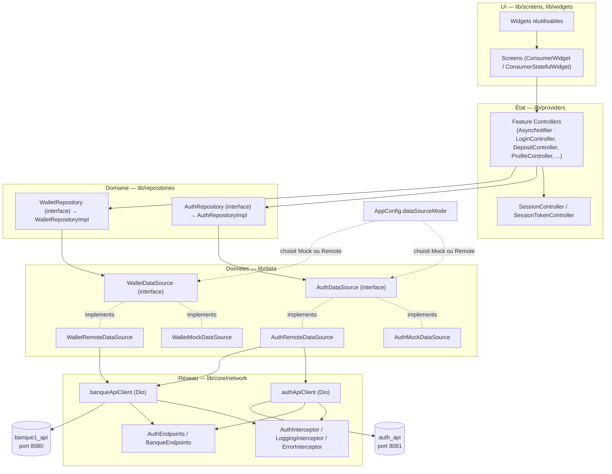

# Architecture

Clean Architecture en 4 couches. Chaque flèche est une dépendance à sens unique : l'UI ne connaît que Riverpod, Riverpod ne connaît que les Repository (interfaces), les Repository ne connaissent que les DataSource (interfaces). Mock et Remote sont interchangeables au niveau DataSource sans toucher aux couches au-dessus.



## Rôle de chaque couche

| Couche | Dossier | Rôle |
|---|---|---|
| UI | `lib/screens/`, `lib/widgets/` | Affichage uniquement. Aucune logique métier : lit l'état via `ref.watch`, déclenche des actions via `ref.read(...).notifier`. |
| État | `lib/providers/` | Un `AsyncNotifier` par action utilisateur (ex. `LoginController.login()`, `DepositController.submit()`), qui expose `AsyncValue` (Loading/Success/Error) consommé par `.when()` dans les écrans. `SessionController` et `SessionTokenController` détiennent la session en mémoire (utilisateur connecté + jeton simulé). |
| Domaine | `lib/repositories/` | Contrat stable (`AuthRepository`, `WalletRepository`) que les Controllers appellent. `*RepositoryImpl` ne fait que déléguer à un `DataSource` injecté au constructeur — c'est le seul point de couture entre logique métier et origine des données. |
| Données | `lib/data/` | `AuthDataSource`/`WalletDataSource` sont des interfaces. `AuthMockDataSource`/`WalletMockDataSource` (dans `data/mock/`) simulent le backend en mémoire. `AuthRemoteDataSource`/`WalletRemoteDataSource` (dans `data/remote/`) appellent auth_api/banque1_api via `ApiClient`, et convertissent les DTO JSON (`lib/models/dto/`) en modèles de domaine (`lib/models/`). |
| Réseau | `lib/core/network/` | `ApiClient` encapsule Dio (une instance par backend : `authApiClientProvider`, `banqueApiClientProvider`), `AuthEndpoints`/`BanqueEndpoints` centralisent les chemins, trois interceptors gèrent le JWT, les logs et la normalisation des erreurs (`ApiException`). `ApiClient.guardData` dé-enveloppe en plus le `{ success, message, data }` commun aux deux backends. |

## Bascule Mock ↔ Remote

`lib/providers/auth_providers.dart` et `wallet_providers.dart` choisissent l'implémentation à injecter selon `AppConfig.dataSourceMode` (`lib/config/app_config.dart`) :

```dart
final authDataSourceProvider = Provider<AuthDataSource>((ref) {
  return switch (AppConfig.dataSourceMode) {
    DataSourceMode.mock => AuthMockDataSource(),
    DataSourceMode.remote => AuthRemoteDataSource(
        ref.watch(authApiClientProvider),
        ref.watch(banqueApiClientProvider),
      ),
  };
});
```

Détails complets dans [mock-to-remote-migration.md](mock-to-remote-migration.md).

## Autres dossiers

- `lib/core/theme/` — thème Material 3 clair/sombre (`AppTheme`, `AppColors`, `AppColorsExtension`, `AppTextStyles`).
- `lib/core/errors/` — `AppException` (erreur métier remontée jusqu'à l'UI) et `ApiException` (erreur réseau interne, traduite en `AppException` avant de sortir de `RemoteDataSource`).
- `lib/routes/` — `GoRouter` (`app_router.dart`), chemins (`route_paths.dart`), transitions de page partagées (`page_transitions.dart`).
- `lib/models/` — modèles de domaine (`Equatable`, sans JSON). `lib/models/dto/` — leurs équivalents JSON (`fromJson`/`toJson`/`toDomain`/`fromDomain`).
- `lib/services/` — services transverses hors DataSource (ex. `SessionStorageService`, wrapper `flutter_secure_storage`).
- `lib/utils/` — validateurs de formulaire et formatteurs, sans état ni dépendance UI.
