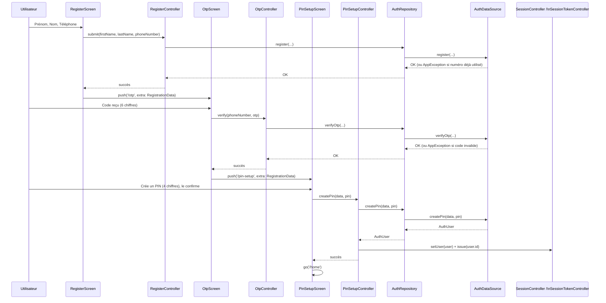
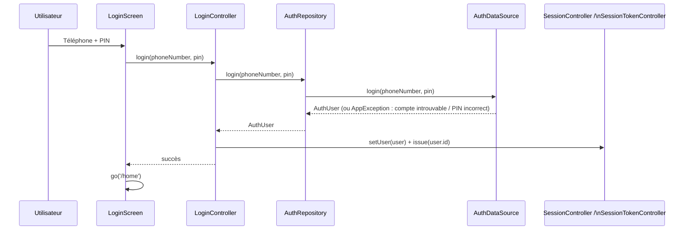
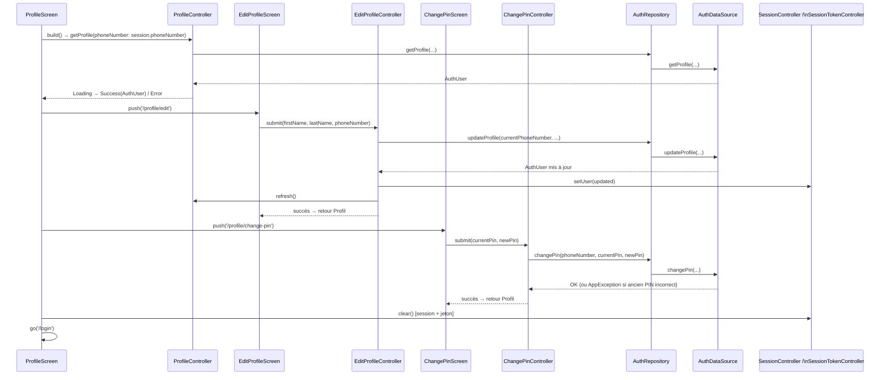

# Flux d'authentification

Tous les flux suivent le même chemin : `Screen → *Controller (AsyncNotifier) → AuthRepository → AuthDataSource (Mock ou Remote)`. En cas de succès qui établit une session, le Controller met à jour `SessionController` (utilisateur courant) et `SessionTokenController` (jeton JWT simulé, persisté via `SessionStorageService`).

## 1. Inscription (Register → OTP → PIN)

Trois écrans, un seul `RegistrationData` transmis de proche en proche via les paramètres `extra` de GoRouter.

Un `redirect` GoRouter renvoie vers `/register` si `/otp` ou `/pin-setup` sont atteints sans `RegistrationData` (deep link direct, refresh navigateur web, etc.).

## 2. Connexion

## 3. Gestion du profil (affichage, modification, changement de PIN, déconnexion)

`ChangePinScreen` vérifie l'ancien PIN **côté DataSource**, jamais côté UI — le formulaire ne fait qu'enchaîner 3 saisies de 4 chiffres (ancien, nouveau, confirmation) avant d'appeler `submit`.
