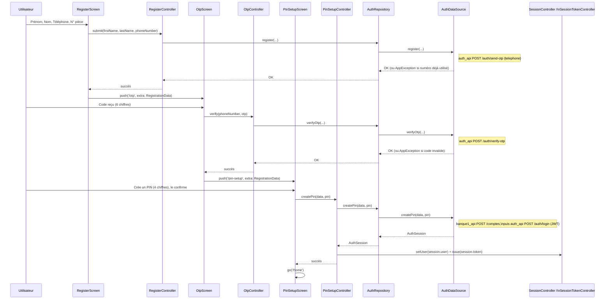
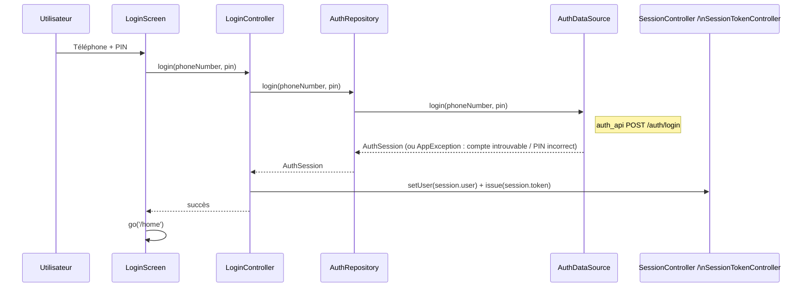
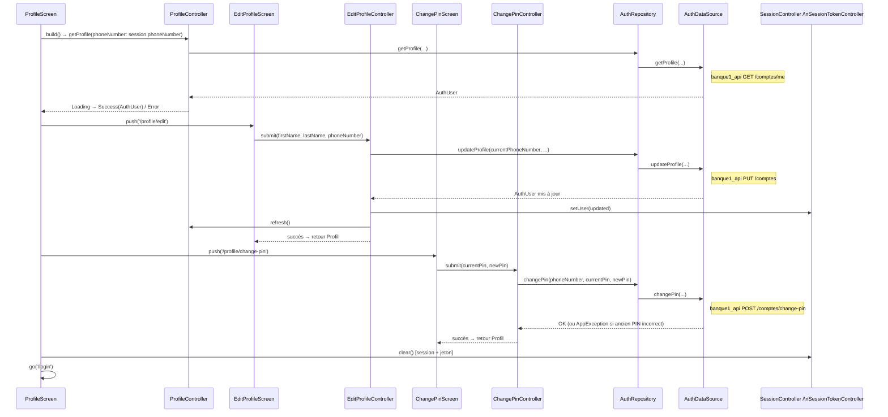

# Flux d'authentification

Tous les flux suivent le même chemin : `Screen → *Controller (AsyncNotifier) → AuthRepository → AuthDataSource (Mock ou Remote)`. `login` et `createPin` retournent un `AuthSession` (utilisateur + jeton) — banque1_api n'émettant de JWT qu'au login, jamais à la création de compte, `AuthRemoteDataSource.createPin` enchaîne un login juste après avoir créé le compte. Le Controller met ensuite à jour `SessionController` (utilisateur courant) et `SessionTokenController.issue(session.token)` (jeton JWT réel en mode remote, simulé par `AuthMockDataSource` en mode mock), persisté via `SessionStorageService`.

## 1. Inscription (Register → OTP → PIN)

Trois écrans, un seul `RegistrationData` (dont `numPiece`, obligatoire) transmis de proche en proche via les paramètres `extra` de GoRouter.

Un `redirect` GoRouter renvoie vers `/register` si `/otp` ou `/pin-setup` sont atteints sans `RegistrationData` (deep link direct, refresh navigateur web, etc.).

## 2. Connexion

## 3. Gestion du profil (affichage, modification, changement de PIN, déconnexion)

`ChangePinScreen` vérifie l'ancien PIN **côté DataSource**, jamais côté UI — le formulaire ne fait qu'enchaîner 3 saisies de 4 chiffres (ancien, nouveau, confirmation) avant d'appeler `submit`.

## 4. Re-vérification du PIN avant une opération sensible

`WithdrawController` et `PaymentController` appellent `AuthRepository.verifyPin(phoneNumber, pin)` avant respectivement le retrait et le paiement, comme confirmation supplémentaire. Côté remote, ceci appelle `banque1_api POST /comptes/verify-pin` (JWT + PIN), qui réutilise `CompteHelper.verifierPin` — la même logique que `POST /transactions/paiement-externe` (paiement initié par gestion_service_api) et l'authentification au login.
