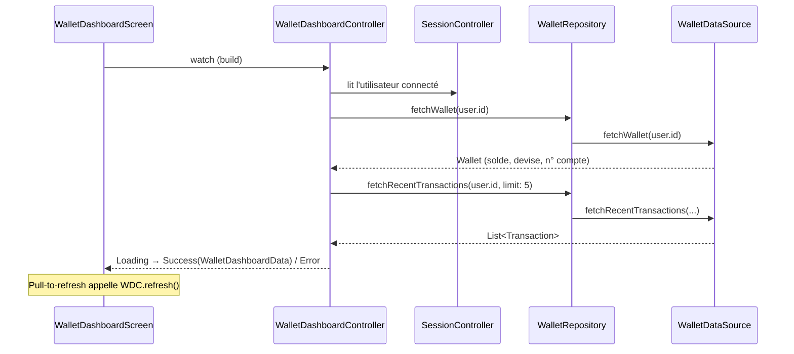
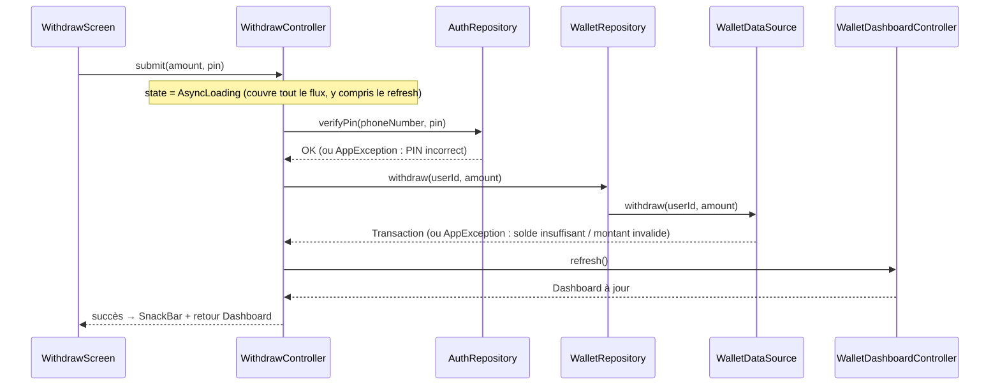
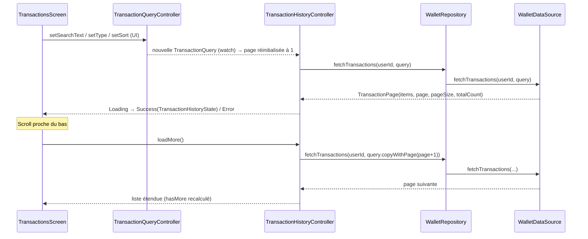

# Flux Wallet (transactions)

Même principe que l'authentification : `Screen → *Controller (AsyncNotifier) → WalletRepository → WalletDataSource (Mock ou Remote)`. Les opérations qui débitent/créditent (`Dépôt`, `Retrait`, `Paiement`) revérifient toujours le PIN côté serveur (`AuthRepository.verifyPin`) avant de toucher au solde — jamais de confiance dans une vérification faite uniquement côté UI.

## 1. Chargement du Dashboard

## 2. Dépôt / Retrait / Paiement

Les trois écrans suivent le même schéma ; Retrait et Paiement ajoutent la vérification de PIN. L'exemple ci-dessous est le Retrait (le plus complet) :

Dépôt : identique sans l'étape `verifyPin`. Paiement : identique au Retrait, avec un champ `label` (motif) en plus dans la requête.

**Détail important :** le rafraîchissement du Dashboard (`WDC.refresh()`) est appelé **à l'intérieur** du même bloc `AsyncValue.guard` que l'opération elle-même, pas après — sinon le bouton arrête de tourner avant que le nouveau solde soit affiché, ouvrant une fenêtre de double-soumission (bug réel corrigé à l'Étape 4, voir l'historique du projet).

## 3. Historique paginé (recherche, filtre, tri)

`TransactionQuery` est modélisé comme les paramètres d'une requête REST (`type`, `q`, `sortBy`, `sortOrder`, `page`, `pageSize`), mais banque1_api ne les supporte pas côté serveur : `WalletRemoteDataSource` récupère la liste complète (`GET /transactions/me`) et applique filtre/tri/pagination côté client — voir « Écarts absorbés côté Flutter » dans [api-endpoints.md](api-endpoints.md). `TQC`/`THC` et les écrans n'en savent rien.
